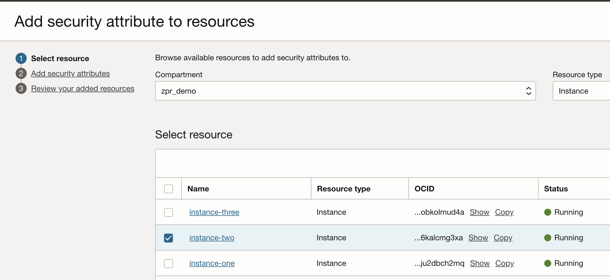

# Limit Access to a compute host

## Introduction

Estimated Lab Time: -- 10 minutes

### About Zero Trust Packet Routing Protection

In this lab we show that you can connect to your compute instances and run ssh command lines andd then after applying ZPR attribute on one or more compute instances you will not be able to connect again until after you create a ZPR policy to allow access to the resource.

### Objectives

In this lab, you will:

* ssh into both your lab instances from your computer
* ssh into instance one and then ssh into instance two from instance one
* Navigate to the ZPR policy screen
* Write a ZPR policy that protects instance two
* See that you can no longer ssh into instance two from instance one or your computer
* Create a ZPR policy to allow instance one to access instance two

### Prerequisites

This lab assumes you have:

* An Oracle Cloud account or using a livelabs sandbox
* Have already created 2 small compute instances
* Have already created a small autonomous database
* Have created ZPR namespace and some security attributes

> **Note:** - any IP addresses used in image or videos were temporary ones and do not exist for anyone to use.

## Task 1: ssh into both instances

It's a good idea to keep the ssh keys for your instances in the same place. Make sure that you copy the key for instance two onto your instance one.
Let's ssh from your computer into both instances and then also ssh into instance two from instance one.

* Copy the ssh key for instance two to instance one

 ```
  <copy>
  smith@smith-mac keys % scp -i ssh-key-instance-one.key ssh-key-instance-two.key opc@xxx.xxx.xxx.xxx:/home/opc/two.key

  ssh-key-instance-two.key              100% 1675    22.3KB/s   00:00
  </copy>
  ```

* ssh into instance two and then exit that session.

 ```
  <copy>smith@smith-mac keys % ssh -i ssh-key-instance-two.key  opc@xxx.xxx.xxx.two
    Last login: Fri Dec  6 23:00:28 2024 from yyy.yyy.yyy.yyy
    [opc@instance-two ~]$ ls -ls
    total 0
    [opc@instance-two ~]$ pwd
    /home/opc
    [opc@instance-two ~]$ exit
    logout
    </copy>
  ```
* ssh into instance one and while in that session also ssh into instance two
  ```
  <copy>smith@smith-mac keys % ssh -i ssh-key-instance-one.key  opc@xxx.xxx.xxx.one
    Last login: Fri Dec  6 22:00:00 2024 from yyy.yyy.yyy.yyy
    [opc@instance-one ~]$ ls -ls
    total 0
    [opc@instance-one ~]$ pwd
    /home/opc
    ssh -i ssh-key-instance-two.key  opc@xxx.internal.ip.two
    [opc@instance-two ~] exit
    logout
    [opc@instance-one ~] exit
    logout
    </copy>
  ```

## Task 2: Navigate to the ZPR policy screen and protect instance two

Now we will apply an attribute to your instance two. This will protect your instance from networking connections until you create a policy to allow a connection to your newly protected resource.

1. Navigate to the ZPR Protected Resources screen.

  

1. Add a security attribute to a resource. In this case we will choose instance two and associate that with the safe_instance attribute. Once this is completed it will then block connections from everywhere to instance two.

  

## Task 3: Try to ssh into instance 2

Try to ssh from your laptop and also try from your first compute instance. Your connection attempt should be refused because the security attribute has been applied and you haven’t yet written ZPR policy to allow the connection.

```
  <copy>smith@smith-mac keys % ssh -i ssh-key-instance-two.key  opc@xxx.xxx.xxx.two
    ssh: connect to host xxx.xxx.xxx.two port 22: Connection refused
    </copy>


  <copy>smith@smith-mac keys % ssh -i ssh-key-instance-one.key  opc@xxx.xxx.xxx.one
    Last login: Fri Dec  6 22:00:00 2024 from yyy.yyy.yyy.yyy
    [opc@instance-one ~]$ ls -ls
    total 0
    [opc@instance-one ~]$ pwd
    /home/opc
    ssh -i ssh-key-instance-two.key  opc@xxx.internal.ip.two
    ssh: connect to host xxx.internal.ip.two port 22: Connection refused
    [opc@instance-one ~] exit
    logout
    </copy>
  ```

## Task 4: Navigate to the ZPR policy screen and configure access to instance two

1. Navigate to ZPR policies screen and create a policy to allow instance one to connect to instance two. This will allow just this one instance to connect to instance two. This is how you can control who/what can access your compute instances. Reviewing these policies allow you to know exactly what's going to be able to communicate with a given instance.
**Note:** Currently - you must allow the networking security rule to allow ingress for at least port 22. Security list configurations are evaluated in addition to ZPR policy. They must both permit the connection. In later ZPR releases we will not need to worry about this setting as ZPR will fully control this access.

**Note** You would never use 0.0.0.0/0 in production but you would normally use something to limit it to your specific laptop's IP address or something very close to it like 192.1.223.0/12 So try to limit the ingress to a much smaller foot print then all possible IP addresses as done in this screen shot. You should also limit the traffic to port 22 for ssh only to limit someone from trying to attack your server using other tools/ports.

  

  

-- Add a security attribute to the instance
  

  

## Task 5: Try to ssh into instance 2

```
  <copy>smith@smith-mac keys % ssh -i ssh-key-instance-two.key  opc@xxx.xxx.xxx.two
    ssh: connect to host xxx.xxx.xxx.two port 22: Connection refused
    </copy>


  <copy>smith@smith-mac keys % ssh -i ssh-key-instance-one.key  opc@xxx.xxx.xxx.one
    Last login: Fri Dec  6 22:00:00 2024 from yyy.yyy.yyy.yyy
    [opc@instance-one ~]$ ls -ls
    total 0
    [opc@instance-one ~]$ pwd
    /home/opc
    ssh -i ssh-key-instance-two.key  opc@xxx.internal.ip.two
    [opc@instance-two ~] exit
    logout
    [opc@instance-one ~] exit
    logout
    </copy>
  ```

> **Note:** that you can now only log into instance two from instance one. All connections attempts from the internet are blocked as well as from all other OCI compute instances.

## Learn More

* [OCI Zero Trust Packet Routing](https://www.oracle.com/security/cloud-security/zero-trust-packet-routing/)
* [ZPR Help documents](https://docs.oracle.com/en-us/iaas/Content/zero-trust-packet-routing/overview.htm)

## Acknowledgements

- **Author** - Jim Smith, Principle Product Manager OCI
- **Contributors** - Dmitry Erastov, Consulting Member of Technical Staff OCI
- **Last Updated By/Date** - Jim Smith, February 2025